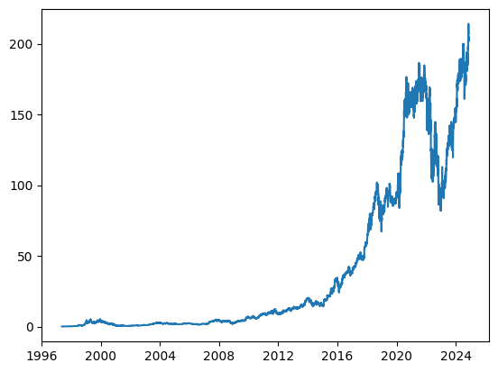
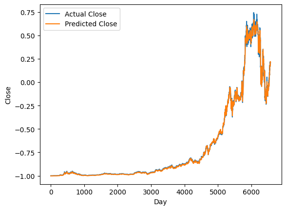

```python
import pandas as pd
import numpy as np
import matplotlib.pyplot as plt
from torch.utils.tensorboard import SummaryWriter

import torch
import torch.nn as nn

writer = SummaryWriter(log_dir='runs/lstm_amazon')
data = pd.read_csv('AMZN_historical_data.csv')

data
```


<div>
<style scoped>
    .dataframe tbody tr th:only-of-type {
        vertical-align: middle;
    }

    .dataframe tbody tr th {
        vertical-align: top;
    }

    .dataframe thead th {
        text-align: right;
    }
</style>
<table border="1" class="dataframe">
  <thead>
    <tr style="text-align: right;">
      <th></th>
      <th>Date</th>
      <th>Open</th>
      <th>High</th>
      <th>Low</th>
      <th>Close</th>
      <th>Adj Close</th>
      <th>Volume</th>
    </tr>
  </thead>
  <tbody>
    <tr>
      <th>0</th>
      <td>1997-05-15</td>
      <td>0.121875</td>
      <td>0.125000</td>
      <td>0.096354</td>
      <td>0.097917</td>
      <td>0.097917</td>
      <td>1443120000</td>
    </tr>
    <tr>
      <th>1</th>
      <td>1997-05-16</td>
      <td>0.098438</td>
      <td>0.098958</td>
      <td>0.085417</td>
      <td>0.086458</td>
      <td>0.086458</td>
      <td>294000000</td>
    </tr>
    <tr>
      <th>2</th>
      <td>1997-05-19</td>
      <td>0.088021</td>
      <td>0.088542</td>
      <td>0.081250</td>
      <td>0.085417</td>
      <td>0.085417</td>
      <td>122136000</td>
    </tr>
    <tr>
      <th>3</th>
      <td>1997-05-20</td>
      <td>0.086458</td>
      <td>0.087500</td>
      <td>0.081771</td>
      <td>0.081771</td>
      <td>0.081771</td>
      <td>109344000</td>
    </tr>
    <tr>
      <th>4</th>
      <td>1997-05-21</td>
      <td>0.081771</td>
      <td>0.082292</td>
      <td>0.068750</td>
      <td>0.071354</td>
      <td>0.071354</td>
      <td>377064000</td>
    </tr>
    <tr>
      <th>...</th>
      <td>...</td>
      <td>...</td>
      <td>...</td>
      <td>...</td>
      <td>...</td>
      <td>...</td>
      <td>...</td>
    </tr>
    <tr>
      <th>6920</th>
      <td>2024-11-13</td>
      <td>209.399994</td>
      <td>215.089996</td>
      <td>209.139999</td>
      <td>214.100006</td>
      <td>214.100006</td>
      <td>46212900</td>
    </tr>
    <tr>
      <th>6921</th>
      <td>2024-11-14</td>
      <td>214.160004</td>
      <td>215.899994</td>
      <td>210.880005</td>
      <td>211.479996</td>
      <td>211.479996</td>
      <td>42620300</td>
    </tr>
    <tr>
      <th>6922</th>
      <td>2024-11-15</td>
      <td>206.759995</td>
      <td>207.339996</td>
      <td>199.610001</td>
      <td>202.610001</td>
      <td>202.610001</td>
      <td>86591100</td>
    </tr>
    <tr>
      <th>6923</th>
      <td>2024-11-18</td>
      <td>204.149994</td>
      <td>204.669998</td>
      <td>200.949997</td>
      <td>201.699997</td>
      <td>201.699997</td>
      <td>36512500</td>
    </tr>
    <tr>
      <th>6924</th>
      <td>2024-11-19</td>
      <td>199.330002</td>
      <td>205.300003</td>
      <td>198.779999</td>
      <td>204.610001</td>
      <td>204.610001</td>
      <td>30916900</td>
    </tr>
  </tbody>
</table>
<p>6925 rows × 7 columns</p>
</div>


```python
data = data[['Date', 'Close']]
data
```


<div>
<style scoped>
    .dataframe tbody tr th:only-of-type {
        vertical-align: middle;
    }

    .dataframe tbody tr th {
        vertical-align: top;
    }

    .dataframe thead th {
        text-align: right;
    }
</style>
<table border="1" class="dataframe">
  <thead>
    <tr style="text-align: right;">
      <th></th>
      <th>Date</th>
      <th>Close</th>
    </tr>
  </thead>
  <tbody>
    <tr>
      <th>0</th>
      <td>1997-05-15</td>
      <td>0.097917</td>
    </tr>
    <tr>
      <th>1</th>
      <td>1997-05-16</td>
      <td>0.086458</td>
    </tr>
    <tr>
      <th>2</th>
      <td>1997-05-19</td>
      <td>0.085417</td>
    </tr>
    <tr>
      <th>3</th>
      <td>1997-05-20</td>
      <td>0.081771</td>
    </tr>
    <tr>
      <th>4</th>
      <td>1997-05-21</td>
      <td>0.071354</td>
    </tr>
    <tr>
      <th>...</th>
      <td>...</td>
      <td>...</td>
    </tr>
    <tr>
      <th>6920</th>
      <td>2024-11-13</td>
      <td>214.100006</td>
    </tr>
    <tr>
      <th>6921</th>
      <td>2024-11-14</td>
      <td>211.479996</td>
    </tr>
    <tr>
      <th>6922</th>
      <td>2024-11-15</td>
      <td>202.610001</td>
    </tr>
    <tr>
      <th>6923</th>
      <td>2024-11-18</td>
      <td>201.699997</td>
    </tr>
    <tr>
      <th>6924</th>
      <td>2024-11-19</td>
      <td>204.610001</td>
    </tr>
  </tbody>
</table>
<p>6925 rows × 2 columns</p>
</div>


```python
device = 'cuda:0' if torch.cuda.is_available() else 'mps'
device
```


    'mps'


```python
# Transform to a panda date type
data['Date'] = pd.to_datetime(data['Date'])
# Do a graph of the closing value with the date
plt.plot(data['Date'], data['Close'])
```

    /var/folders/0_/gschhs596250ygzy70q0br4r0000gn/T/ipykernel_34897/813086950.py:2: SettingWithCopyWarning: 
    A value is trying to be set on a copy of a slice from a DataFrame.
    Try using .loc[row_indexer,col_indexer] = value instead
    
    See the caveats in the documentation: https://pandas.pydata.org/pandas-docs/stable/user_guide/indexing.html#returning-a-view-versus-a-copy
      data['Date'] = pd.to_datetime(data['Date'])


    [<matplotlib.lines.Line2D at 0x336329310>]


    

    


```python
from copy import deepcopy as dc

# Take the dataframes and the number (look back window)
def prepare_dataframe_for_lstm(df, n_steps):
    # Deep copy of the dataframe
    df = dc(df)
    # Set the index to Date
    df.set_index('Date', inplace=True)

    for i in range(1, n_steps+1):
        df[f'Close(t-{i})'] = df['Close'].shift(i)

    df.dropna(inplace=True)

    return df

lookback = 7
shifted_df = prepare_dataframe_for_lstm(data, lookback)
shifted_df
```


<div>
<style scoped>
    .dataframe tbody tr th:only-of-type {
        vertical-align: middle;
    }

    .dataframe tbody tr th {
        vertical-align: top;
    }

    .dataframe thead th {
        text-align: right;
    }
</style>
<table border="1" class="dataframe">
  <thead>
    <tr style="text-align: right;">
      <th></th>
      <th>Close</th>
      <th>Close(t-1)</th>
      <th>Close(t-2)</th>
      <th>Close(t-3)</th>
      <th>Close(t-4)</th>
      <th>Close(t-5)</th>
      <th>Close(t-6)</th>
      <th>Close(t-7)</th>
    </tr>
    <tr>
      <th>Date</th>
      <th></th>
      <th></th>
      <th></th>
      <th></th>
      <th></th>
      <th></th>
      <th></th>
      <th></th>
    </tr>
  </thead>
  <tbody>
    <tr>
      <th>1997-05-27</th>
      <td>0.079167</td>
      <td>0.075000</td>
      <td>0.069792</td>
      <td>0.071354</td>
      <td>0.081771</td>
      <td>0.085417</td>
      <td>0.086458</td>
      <td>0.097917</td>
    </tr>
    <tr>
      <th>1997-05-28</th>
      <td>0.076563</td>
      <td>0.079167</td>
      <td>0.075000</td>
      <td>0.069792</td>
      <td>0.071354</td>
      <td>0.081771</td>
      <td>0.085417</td>
      <td>0.086458</td>
    </tr>
    <tr>
      <th>1997-05-29</th>
      <td>0.075260</td>
      <td>0.076563</td>
      <td>0.079167</td>
      <td>0.075000</td>
      <td>0.069792</td>
      <td>0.071354</td>
      <td>0.081771</td>
      <td>0.085417</td>
    </tr>
    <tr>
      <th>1997-05-30</th>
      <td>0.075000</td>
      <td>0.075260</td>
      <td>0.076563</td>
      <td>0.079167</td>
      <td>0.075000</td>
      <td>0.069792</td>
      <td>0.071354</td>
      <td>0.081771</td>
    </tr>
    <tr>
      <th>1997-06-02</th>
      <td>0.075521</td>
      <td>0.075000</td>
      <td>0.075260</td>
      <td>0.076563</td>
      <td>0.079167</td>
      <td>0.075000</td>
      <td>0.069792</td>
      <td>0.071354</td>
    </tr>
    <tr>
      <th>...</th>
      <td>...</td>
      <td>...</td>
      <td>...</td>
      <td>...</td>
      <td>...</td>
      <td>...</td>
      <td>...</td>
      <td>...</td>
    </tr>
    <tr>
      <th>2024-11-13</th>
      <td>214.100006</td>
      <td>208.910004</td>
      <td>206.839996</td>
      <td>208.179993</td>
      <td>210.050003</td>
      <td>207.089996</td>
      <td>199.500000</td>
      <td>195.779999</td>
    </tr>
    <tr>
      <th>2024-11-14</th>
      <td>211.479996</td>
      <td>214.100006</td>
      <td>208.910004</td>
      <td>206.839996</td>
      <td>208.179993</td>
      <td>210.050003</td>
      <td>207.089996</td>
      <td>199.500000</td>
    </tr>
    <tr>
      <th>2024-11-15</th>
      <td>202.610001</td>
      <td>211.479996</td>
      <td>214.100006</td>
      <td>208.910004</td>
      <td>206.839996</td>
      <td>208.179993</td>
      <td>210.050003</td>
      <td>207.089996</td>
    </tr>
    <tr>
      <th>2024-11-18</th>
      <td>201.699997</td>
      <td>202.610001</td>
      <td>211.479996</td>
      <td>214.100006</td>
      <td>208.910004</td>
      <td>206.839996</td>
      <td>208.179993</td>
      <td>210.050003</td>
    </tr>
    <tr>
      <th>2024-11-19</th>
      <td>204.610001</td>
      <td>201.699997</td>
      <td>202.610001</td>
      <td>211.479996</td>
      <td>214.100006</td>
      <td>208.910004</td>
      <td>206.839996</td>
      <td>208.179993</td>
    </tr>
  </tbody>
</table>
<p>6918 rows × 8 columns</p>
</div>


```python
# Convert the data to numpy format
shifted_df_as_np = shifted_df.to_numpy()

shifted_df_as_np
```


    array([[7.91670000e-02, 7.50000000e-02, 6.97920000e-02, ...,
            8.54170000e-02, 8.64580000e-02, 9.79170000e-02],
           [7.65630000e-02, 7.91670000e-02, 7.50000000e-02, ...,
            8.17710000e-02, 8.54170000e-02, 8.64580000e-02],
           [7.52600000e-02, 7.65630000e-02, 7.91670000e-02, ...,
            7.13540000e-02, 8.17710000e-02, 8.54170000e-02],
           ...,
           [2.02610001e+02, 2.11479996e+02, 2.14100006e+02, ...,
            2.08179993e+02, 2.10050003e+02, 2.07089996e+02],
           [2.01699997e+02, 2.02610001e+02, 2.11479996e+02, ...,
            2.06839996e+02, 2.08179993e+02, 2.10050003e+02],
           [2.04610001e+02, 2.01699997e+02, 2.02610001e+02, ...,
            2.08910004e+02, 2.06839996e+02, 2.08179993e+02]])


```python
# Count the number of rows and column
shifted_df_as_np.shape
```


    (6918, 8)


```python
# Scaler on all the data
from sklearn.preprocessing import MinMaxScaler

# Transform the numpy value from above to -1, 1
scaler = MinMaxScaler(feature_range=(-1, 1))
shifted_df_as_np = scaler.fit_transform(shifted_df_as_np)

shifted_df_as_np
```


    array([[-0.99992212, -0.99996106, -1.        , ..., -0.99985118,
            -0.99984126, -0.99973212],
           [-0.99994646, -0.99992212, -0.99995133, ..., -0.9998859 ,
            -0.99985118, -0.99984126],
           [-0.99995863, -0.99994646, -0.9999124 , ..., -0.99998512,
            -0.9998859 , -0.99985118],
           ...,
           [ 0.89263141,  0.97551726,  1.        , ...,  0.9821887 ,
             1.        ,  0.9718068 ],
           [ 0.88412786,  0.89263141,  0.97551738, ...,  0.96942562,
             0.9821887 ,  1.        ],
           [ 0.91132045,  0.88412786,  0.89263193, ...,  0.98914184,
             0.96942562,  0.9821887 ]])


```python
# X = All the rows above without the first column
X = shifted_df_as_np[:, 1:]
# Predicter, all the rows but just the first column
y = shifted_df_as_np[:, 0]

X.shape, y.shape
```


    ((6918, 7), (6918,))


```python
# Make a deep copy but flipping it, to have the oldest value first
X = dc(np.flip(X, axis=1))
X
```


    array([[-0.99973212, -0.99984126, -0.99985118, ..., -0.9999854 ,
            -1.        , -0.99996106],
           [-0.99984126, -0.99985118, -0.9998859 , ..., -1.        ,
            -0.99995133, -0.99992212],
           [-0.99985118, -0.9998859 , -0.99998512, ..., -0.99995133,
            -0.9999124 , -0.99994646],
           ...,
           [ 0.9718068 ,  1.        ,  0.9821887 , ...,  0.95150216,
             1.        ,  0.97551726],
           [ 1.        ,  0.9821887 ,  0.96942562, ...,  1.        ,
             0.97551738,  0.89263141],
           [ 0.9821887 ,  0.96942562,  0.98914184, ...,  0.97551738,
             0.89263193,  0.88412786]])


```python
# Splitting to train and test 95% as train and 5% as test
split_index = int(len(X) * 0.95)

split_index
```


    6572


```python
# Up util the split index
X_train = X[:split_index]
# Split index onward
X_test = X[split_index:]

y_train = y[:split_index]
y_test = y[split_index:]

X_train.shape, X_test.shape, y_train.shape, y_test.shape
```


    ((6572, 7), (346, 7), (6572,), (346,))


```python
# Requirement for PyTorch LSTM to have an extra dimension at the end
X_train = X_train.reshape((-1, lookback, 1))
X_test = X_test.reshape((-1, lookback, 1))

y_train = y_train.reshape((-1, 1))
y_test = y_test.reshape((-1, 1))

X_train.shape, X_test.shape, y_train.shape, y_test.shape
```


    ((6572, 7, 1), (346, 7, 1), (6572, 1), (346, 1))


```python
# Wrap in pytorch tensor and make sure they are float
X_train = torch.tensor(X_train).float()
y_train = torch.tensor(y_train).float()
X_test = torch.tensor(X_test).float()
y_test = torch.tensor(y_test).float()

X_train.shape, X_test.shape, y_train.shape, y_test.shape
```


    (torch.Size([6572, 7, 1]),
     torch.Size([346, 7, 1]),
     torch.Size([6572, 1]),
     torch.Size([346, 1]))


```python
# We use dataset instead of tensor
from torch.utils.data import Dataset

# Custom class to transform the tensor to a dataset
class TimeSeriesDataset(Dataset):
    def __init__(self, X, y):
        self.X = X
        self.y = y

    def __len__(self):
        return len(self.X)

    def __getitem__(self, i):
        return self.X[i], self.y[i]

train_dataset = TimeSeriesDataset(X_train, y_train)
test_dataset = TimeSeriesDataset(X_test, y_test)
```


```python
# Wrap the dataset in dataloader to get the batches
from torch.utils.data import DataLoader

# Batch size of 16
batch_size = 16

# Train dataloader with our train_dataset, we shuffle everytime
train_loader = DataLoader(train_dataset, batch_size=batch_size, shuffle=True)
# The same but without shuffling
test_loader = DataLoader(test_dataset, batch_size=batch_size, shuffle=False)
```


```python
# Looping over our train_loader
for _, batch in enumerate(train_loader):
    # Get the x_batch and the y_batch to check the size
    x_batch, y_batch = batch[0].to(device), batch[1].to(device)
    print(x_batch.shape, y_batch.shape)
    break
```

    torch.Size([16, 7, 1]) torch.Size([16, 1])


```python
class LSTM(nn.Module):
    # Input size: number of features 1, hidden_size: However dimension we want in the middle could increase the overfitting,
    # num_stacked_layers: Stacked LSTM because they produce a sequence
    def __init__(self, input_size, hidden_size, num_stacked_layers):
        super().__init__()
        self.hidden_size = hidden_size
        self.num_stacked_layers = num_stacked_layers

        self.lstm = nn.LSTM(input_size, hidden_size, num_stacked_layers,
                            batch_first=True)
        # After LSTM you want a fully connected layer map of our hidden size to 1 because at the end you just need the final closing value
        self.fc = nn.Linear(hidden_size, 1)

    def forward(self, x):
        # Batch size from the input, dynamiccaly
        batch_size = x.size(0)
        # Gates, initalize the LSTM with default h0 and c0
        h0 = torch.zeros(self.num_stacked_layers, batch_size, self.hidden_size).to(device)
        c0 = torch.zeros(self.num_stacked_layers, batch_size, self.hidden_size).to(device)
        # When you want to use the LSTM you pass those in the tuple, out = output, _ = updated tuple
        out, _ = self.lstm(x, (h0, c0))
        # The output has to pass in the fc layer
        out = self.fc(out[:, -1, :])
        return out

model = LSTM(1, 4, 1)
model.to(device)
model
```


    LSTM(
      (lstm): LSTM(1, 4, batch_first=True)
      (fc): Linear(in_features=4, out_features=1, bias=True)
    )


```python
def train_one_epoch():
    # Model to training mode
    model.train(True)
    print(f'Epoch: {epoch + 1}')
    # Start to accumulate the running_loss
    running_loss = 0.0

    # Loop over the train loader and get the batch_index and the batch
    for batch_index, batch in enumerate(train_loader):
        # Get x_batch and y_batch from the batch and put it on the device we're using
        x_batch, y_batch = batch[0].to(device), batch[1].to(device)

        # Getting the output from the model
        output = model(x_batch)
        # 'Tensor with one value' Getting the loss with the loss_function, comparing the output to the truth from the y_batch
        loss = loss_function(output, y_batch)
        # Incrementing the loss
        running_loss += loss.item()

        # Zero out the gradients
        optimizer.zero_grad()

        # Backward pass through the loss to calculate the gradient
        loss.backward()
        # Step in the direction of the gradient to upgrade our model
        optimizer.step()

        if batch_index % 100 == 99:  # print every 100 batches
            # Average loss across this 100 batches
            avg_loss_across_batches = running_loss / 100
            writer.add_scalar('Train/Loss', avg_loss_across_batches, epoch * len(train_loader) + batch_index)
            print('Batch {0}, Loss: {1:.3f}'.format(batch_index+1,
                                                    avg_loss_across_batches))
            running_loss = 0.0
    print()
```


```python
def validate_one_epoch():
    # Model to valuation mode
    model.train(False)
    running_loss = 0.0

    # Loop over the train loader and get the batch_index and the batch
    for batch_index, batch in enumerate(test_loader):
        # Get x_batch and y_batch from the batch and put it on the device we're using
        x_batch, y_batch = batch[0].to(device), batch[1].to(device)

        # No model update so we don't need to calculate the gradient
        with torch.no_grad():
            output = model(x_batch)
            loss = loss_function(output, y_batch)
            running_loss += loss.item()

    avg_loss_across_batches = running_loss / len(test_loader)
    writer.add_scalar('Validation/Loss', avg_loss_across_batches, epoch)

    print('Val Loss: {0:.3f}'.format(avg_loss_across_batches))
    print('***************************************************')
    print()
```


```python
learning_rate = 0.001
num_epochs = 10
# Regression value because we calculate a continuous value to minimize the mean squared error
loss_function = nn.MSELoss()
optimizer = torch.optim.Adam(model.parameters(), lr=learning_rate)

sample_input = torch.randn(1, lookback, 1).to(device)
writer.add_graph(model, sample_input)

for epoch in range(num_epochs):
    train_one_epoch()
    validate_one_epoch()
```

    Epoch: 1
    Batch 100, Loss: 0.000
    Batch 200, Loss: 0.000
    Batch 300, Loss: 0.000
    Batch 400, Loss: 0.000
    
    Val Loss: 0.004
    ***************************************************
    
    Epoch: 2
    Batch 100, Loss: 0.000
    Batch 200, Loss: 0.000
    Batch 300, Loss: 0.000
    Batch 400, Loss: 0.000
    
    Val Loss: 0.004
    ***************************************************
    
    Epoch: 3
    Batch 100, Loss: 0.000
    Batch 200, Loss: 0.000
    Batch 300, Loss: 0.000
    Batch 400, Loss: 0.000
    
    Val Loss: 0.002
    ***************************************************
    
    Epoch: 4
    Batch 100, Loss: 0.000
    Batch 200, Loss: 0.000
    Batch 300, Loss: 0.000
    Batch 400, Loss: 0.000
    
    Val Loss: 0.002
    ***************************************************
    
    Epoch: 5
    Batch 100, Loss: 0.000
    Batch 200, Loss: 0.000
    Batch 300, Loss: 0.000
    Batch 400, Loss: 0.000
    
    Val Loss: 0.002
    ***************************************************
    
    Epoch: 6
    Batch 100, Loss: 0.000
    Batch 200, Loss: 0.000
    Batch 300, Loss: 0.000
    Batch 400, Loss: 0.000
    
    Val Loss: 0.002
    ***************************************************
    
    Epoch: 7
    Batch 100, Loss: 0.000
    Batch 200, Loss: 0.000
    Batch 300, Loss: 0.000
    Batch 400, Loss: 0.000
    
    Val Loss: 0.002
    ***************************************************
    
    Epoch: 8
    Batch 100, Loss: 0.000
    Batch 200, Loss: 0.000
    Batch 300, Loss: 0.000
    Batch 400, Loss: 0.000
    
    Val Loss: 0.001
    ***************************************************
    
    Epoch: 9
    Batch 100, Loss: 0.000
    Batch 200, Loss: 0.000
    Batch 300, Loss: 0.000
    Batch 400, Loss: 0.000
    
    Val Loss: 0.001
    ***************************************************
    
    Epoch: 10
    Batch 100, Loss: 0.000
    Batch 200, Loss: 0.000
    Batch 300, Loss: 0.000
    Batch 400, Loss: 0.000
    
    Val Loss: 0.001
    ***************************************************
    


```python
# No gradient for the prediction
with torch.no_grad():
    # Give the model the first 95% of the train data then give it to the cpu because numpy only use the cpu
    predicted = model(X_train.to(device)).to('cpu').numpy()


# Plot the y_train, real closing data
plt.plot(y_train, label='Actual Close')
# Plot the predicted closing value
plt.plot(predicted, label='Predicted Close')
plt.xlabel('Day')
plt.ylabel('Close')
plt.legend()
plt.show()
```


    

    


```python
# Flatten to making sure it's one axis
train_predictions = predicted.flatten()

dummies = np.zeros((X_train.shape[0], lookback+1))
dummies[:, 0] = train_predictions
# Inverse transform to transform the -1 1 to real dollar
dummies = scaler.inverse_transform(dummies)

train_predictions = dc(dummies[:, 0])
train_predictions
```


    array([-1.16837181e-01, -1.15918667e-01, -1.15893153e-01, ...,
            1.30069609e+02,  1.30578957e+02,  1.30087492e+02])


```python
# Same as above for the truth
dummies = np.zeros((X_train.shape[0], lookback+1))
dummies[:, 0] = y_train.flatten()
dummies = scaler.inverse_transform(dummies)

new_y_train = dc(dummies[:, 0])
new_y_train
```

    /var/folders/0_/gschhs596250ygzy70q0br4r0000gn/T/ipykernel_34897/61638427.py:3: DeprecationWarning: __array__ implementation doesn't accept a copy keyword, so passing copy=False failed. __array__ must implement 'dtype' and 'copy' keyword arguments.
      dummies[:, 0] = y_train.flatten()


    array([7.91697863e-02, 7.65609526e-02, 7.52597251e-02, ...,
           1.30380005e+02, 1.28360000e+02, 1.29779998e+02])


```python
writer.add_scalars('Predictions/Train', {'Actual': y_train.flatten(), 'Predicted': predicted.flatten()})
plt.plot(new_y_train, label='Actual Close')
plt.plot(train_predictions, label='Predicted Close')
plt.xlabel('Day')
plt.ylabel('Close')
plt.legend()
plt.show()
```


    ---------------------------------------------------------------------------

    AssertionError                            Traceback (most recent call last)

    Cell In[178], line 1
    ----> 1 writer.add_scalars('Predictions/Train', {'Actual': y_train.flatten(), 'Predicted': predicted.flatten()})
          2 plt.plot(new_y_train, label='Actual Close')
          3 plt.plot(train_predictions, label='Predicted Close')


    File ~/dev/IIM/stock-predict/venv/lib/python3.9/site-packages/torch/utils/tensorboard/writer.py:425, in SummaryWriter.add_scalars(self, main_tag, tag_scalar_dict, global_step, walltime)
        421     fw = FileWriter(
        422         fw_tag, self.max_queue, self.flush_secs, self.filename_suffix
        423     )
        424     self.all_writers[fw_tag] = fw
    --> 425 fw.add_summary(scalar(main_tag, scalar_value), global_step, walltime)


    File ~/dev/IIM/stock-predict/venv/lib/python3.9/site-packages/torch/utils/tensorboard/summary.py:372, in scalar(name, tensor, collections, new_style, double_precision)
        355 """Output a `Summary` protocol buffer containing a single scalar value.
        356 
        357 The generated Summary has a Tensor.proto containing the input Tensor.
       (...)
        369   ValueError: If tensor has the wrong shape or type.
        370 """
        371 tensor = make_np(tensor).squeeze()
    --> 372 assert (
        373     tensor.ndim == 0
        374 ), f"Tensor should contain one element (0 dimensions). Was given size: {tensor.size} and {tensor.ndim} dimensions."
        375 # python float is double precision in numpy
        376 scalar = float(tensor)


    AssertionError: Tensor should contain one element (0 dimensions). Was given size: 6572 and 1 dimensions.


```python
# The same as above but for the predictions .detach() do the same as .no_grad()
test_predictions = model(X_test.to(device)).detach().cpu().numpy().flatten()

dummies = np.zeros((X_test.shape[0], lookback+1))
dummies[:, 0] = test_predictions
dummies = scaler.inverse_transform(dummies)

test_predictions = dc(dummies[:, 0])
test_predictions
```


```python
dummies = np.zeros((X_test.shape[0], lookback+1))
dummies[:, 0] = y_test.flatten()
dummies = scaler.inverse_transform(dummies)

new_y_test = dc(dummies[:, 0])
new_y_test
```


```python
writer.add_scalars('Predictions/Test', {'Actual': new_y_test, 'Predicted': test_predictions})
plt.plot(new_y_test, label='Actual Close')
plt.plot(test_predictions, label='Predicted Close')
plt.xlabel('Day')
plt.ylabel('Close')
plt.legend()
plt.show()
```


```python

```
